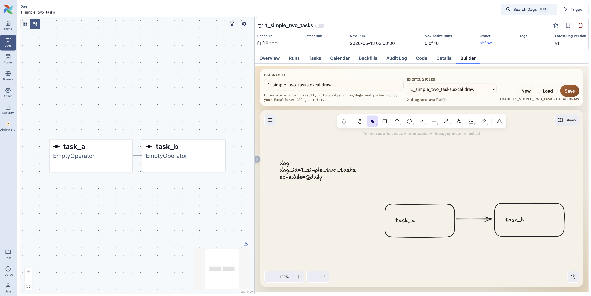
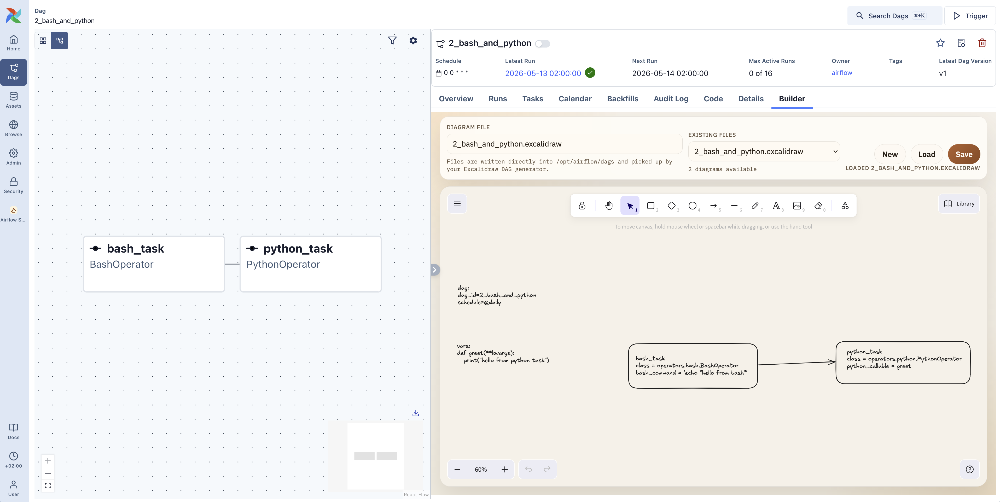

# Airflow Sketcher

Airflow Sketcher is an Airflow 3.1+ plugin to build Airflow DAGs from Excelidraw drawings. 

## What is included

- `src/airflow_sketcher/dag_factory.py`: Excalidraw to Airflow DAG parser/importer.
- `src/airflow_sketcher/plugins/builder.py`: Airflow plugin exposing the Excalidraw builder UI.
- `src/airflow_sketcher/sitecustomize.py`: optional startup hook for importer registration.
- `examples/airflow/`: thin wrapper files that can be mounted into an Airflow `dags/` and `plugins/` folder.
- `tests/`: unit tests and real `.excalidraw` fixtures.

## Local development

### With `uv` (recommended)

```bash
uv sync --all-extras
uv run python -m unittest discover -s tests
```

### With traditional `venv`

```bash
python3 -m venv .venv
source .venv/bin/activate
pip install -e '.[dev]'
python3 -m unittest discover -s tests
```

## Plugin functionality

The `AirflowSketcherPlugin` adds an Excalidraw-based DAG builder page to the Airflow UI under `/airflow-sketcher`.

Key capabilities:

- Renders an interactive Excalidraw canvas in Airflow for creating and editing DAG diagrams.
- Saves diagrams as `.excalidraw` files in the Airflow `DAGS_FOLDER`.
- Enforces safe filenames (letters, numbers, `.`, `_`, `-`) and prevents path traversal.
- Auto-appends the `.excalidraw` extension when omitted.
- Loads existing scenes and preserves selected visual app state (for example grid and viewport settings).
- Derives DAG metadata (such as `dag_id` and `schedule`) from `dag:` text blocks in the drawing.
- Resolves a diagram for an existing DAG by checking DAG params (`excalidraw_source_file`) first, then scanning `.excalidraw` files.
- Registers the Excalidraw importer at startup so saved diagrams can be translated into Airflow DAG objects.

### How to open the plugin

You can open the builder in two ways:

1. Dedicated icon/view:
   Open the Airflow top navigation entry named `Airflow Sketcher` (with the plugin icon). This opens the builder home at `/airflow-sketcher/`.
2. From a DAG created by this plugin:
   Open DAG details and click the `Builder` external view. It opens `/airflow-sketcher/?dag_id=<your_dag_id>` and tries to load the corresponding `.excalidraw` source file.

## First DAG

Create a very simple DAG with two empty tasks in the builder UI:

1. Open Airflow and navigate to `/airflow-sketcher`.
2. Add one text element for DAG metadata with this content:

```text
dag:
dag_id=first_two_tasks
schedule=@daily
```

3. Draw two rectangles (each rectangle is a task).
4. Add text inside the first rectangle:

```text
task_a
```

5. Add text inside the second rectangle:

```text
task_b
```

6. Draw an arrow from `task_a` to `task_b`.
7. Save as `first_two_tasks.excalidraw`.

Notes:

- You do not need to set `class` for this example. If omitted, tasks default to `EmptyOperator`.
- If no `dag_id` is provided in the `dag:` block, the file name (without extension) is used as the DAG ID.

## Examples

### 1. The simplest DAG (two empty tasks)

Use these text blocks:

```text
dag:
dag_id=1_simple_two_tasks
schedule=@daily
```

Task rectangle 1:

```text
task_a
```

Task rectangle 2:

```text
task_b
```

Then draw one arrow: `task_a -> task_b`.

In the Airflow UI, it should look like:




### 2. DAG with BashOperator and PythonOperator

Use these text blocks:

```text
dag:
dag_id=2_bash_and_python
schedule=@daily
```

```text
vars:
def greet(**kwargs):
   print("hello from python task")
```

Task rectangle 1:

```text
bash_task
class = operators.bash.BashOperator
bash_command = 'echo "hello from bash"'
```

Task rectangle 2:

```text
python_task
class = operators.python.PythonOperator
python_callable = greet
```

Then draw one arrow: `bash_task -> python_task`.

In the Airflow UI, it should look like:




## Example files

Ready-to-use `.excalidraw` files are available in `examples/excalidraw/`:

1. [examples/excalidraw/1_simple_two_tasks.excalidraw](examples/excalidraw/1_simple_two_tasks.excalidraw)
2. [examples/excalidraw/2_bash_and_python.excalidraw](examples/excalidraw/2_bash_and_python.excalidraw)

## Supported sections and task attributes

The parser reads specific text blocks from the Excalidraw scene.

### `dag:` section

Use a text element starting with `dag:` and put one `key=value` pair per line.

Supported keys:

- `dag_id`: explicit DAG identifier.
- `schedule`: DAG schedule string (for example `@daily` or cron expression).

If `dag_id` is omitted, the importer uses the `.excalidraw` filename (without extension). If `schedule` is omitted, it defaults to `None`.

Example:

```text
dag:
dag_id=my_first_dag
schedule=@daily
```

### `imports:` section

Use a text element starting with `imports:` to declare Python imports used by tasks.

- Only Python import statements are supported in this block.
- `import ...` and `from ... import ...` are both supported.
- Imported names are available when evaluating task attributes (for example `class`, `python_callable`, `op_args`, `op_kwargs`).
- You can use multiple `imports:` blocks in the same diagram.

Default import behavior:

- No custom project modules are imported automatically. Add them in `imports:` when needed.
- Python builtins are available when evaluating attribute values.
- For the `class` attribute only, the `operators.` prefix is treated as shorthand for `airflow.providers.standard.operators.`.
   - Example: `class = operators.bash.BashOperator` resolves to `airflow.providers.standard.operators.bash.BashOperator`.
- If `class` is omitted, the task defaults to `airflow.providers.standard.operators.empty.EmptyOperator`.

Example:

```text
imports:
from airflow.providers.standard.operators.bash import BashOperator
import shared_funcs
```

### `vars:` section

Use a text element starting with `vars:` to define Python variables/functions reused in task attributes.

- Contents are executed as Python code.
- Names defined here are available when evaluating task attributes (for example `python_callable=my_func`).

Example:

```text
vars:
def my_func(**kwargs):
      print("hello")
```

### Task text format (inside each rectangle)

Each task rectangle is configured by its associated text content.

Supported attributes:

- First non-empty line: task id (required), for example `task_a`.
- `class` (optional): operator class path or imported symbol.
   - Default when omitted: `operators.empty.EmptyOperator`.
- Any other `key=value` lines are passed as operator keyword arguments.

Attribute values support:

- Python literals (strings, numbers, booleans, lists, dicts).
- Names imported or defined in `vars:`.
- Multi-line Python snippets. If a snippet is statements plus a final expression, that expression becomes the value. You can also assign to `result` and that value is used.

Example:

```text
task_python
class = operators.python.PythonOperator
python_callable = my_func
op_kwargs = {"name": "world"}
```

## Airflow integration

Install the package into your Airflow image or environment, then expose the thin wrapper files from `examples/airflow/` inside the Airflow `plugins/` and `dags/` directories.

### Installation

**From PyPI:**
```bash
pip install airflow-sketcher
```

**From sources (editable/development mode):**
```bash
# With uv
uv pip install -e .

# With pip
pip install -e .
```

### Typical setup

1. Install the package (see above).
2. If you are not installing with `pip`, copy the whole `airflow_sketcher` package directory into Airflow's `plugins/` folder (for example as `plugins/airflow_sketcher/`).
3. Copy `examples/airflow/plugins/excalidraw_builder_plugin.py` into Airflow's `plugins/` folder.
4. Copy `examples/airflow/plugins/sitecustomize.py` into Airflow's `plugins/` folder if you want automatic importer registration at process startup.
5. Copy `examples/airflow/dags/airflow_dag_generator.py` into Airflow's `dags/` folder if you want a Python entrypoint that re-exports the factory symbols.

## Testing strategy

The unit tests install lightweight Airflow stubs when Apache Airflow is not installed. That keeps parser and factory coverage runnable in a plain Python environment while still allowing the same package to run under real Airflow.